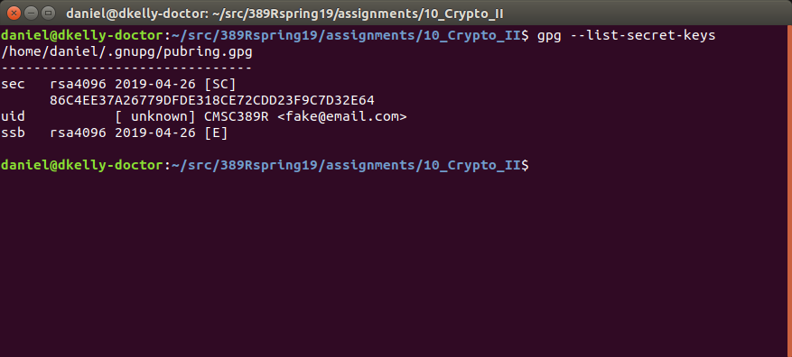
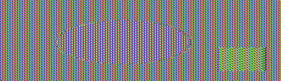

# Crypto II Writeup

Name: Daniel Kelly
Section: 0101

I pledge on my honor that I have not given or received any unauthorized
assistance on this assignment or examination.

Digital acknowledgement: Daniel Kelly

## Assignment Writeup

### Part 1 (70 Pts)

The first step in decrypting this file is to import the GPG key using the command `gpg --import key.asc`.
This adds the key to the system's GPG keyring.
After this, the message can be decrypted using the command `gpg --decrypt message.txt.gpg`.
This reveals the following message:

> hello! if you're reading this, then you've successfully decrypted this message
> 
> your flag is: CMSC389R-{m3ss@g3_!n_A_b0ttl3}
> 
> mention this flag in your part 1 writeup!
> 
> your directions:
> type `gpg --list-secret-keys` and take a screenshot to verify that this
> `key.asc` file has been properly imported.
> 
> next, create a text file called `signature.txt` and write the following inside:
> 
> "My name is <your name here>!"
> 
> replacing the <your name here> part with your actual name.
> 
> Once you've created this file, use `gpg` to sign the file with this new imported
> keyand output it as `signature.txt.asc`. make sure to use the `--clearsign`
> flag to produce an ASCII-armored output.
> 
> Upload only the `signature.txt.asc` file, and make sure it is named as such,
> otherwise the grading script will NOT find it and properly, and you will not
> receive credit for this part.

The command `gpg --list-secret-keys` prints the following, showing the key that has been imported:

The file [signature.txt.asc](signature.txt.asc) contains the signed file, which was generated as instructed.

### Part 2 (30 Pts)

Encrypting the image with AES-128 encryption in ECB mode produces the following image:

Encrypting the image with AES-128 encryption in CBC mode produces the following image:

The 3 different regions of the original image (circle, square, and background) are still discernable in the image resulting from encryption in ECB mode.
In contrast, the image that results from encryption in CBC mode appears completely random, with no discernable structure.

These differences are due the distinct methods used by each mode for encryption.
ECB mode is the simpler of the two.
Under this mode, plaintext data is encrypted on a block-by-block basis, where each block is independent from the last.
This independence does provide some benefit, as it is more resilient to data corruption.
However, since the ciphertext and the actual plaintext have a direct relationship, it is much more vulnerable to cryptographic analysis, such as frequency analysis.

In contrast, CBC mode works by introducing a dependency between blocks.
Each block is XORed with the previous ciphertext block before encryption.
This in theory makes it such that one must be able to decipher every previous block in order to decrypt the next one.
Moreover, it makes cryptanalysis much more difficult, as there is no direct relationship between the plaintext and cyphertext.
As such, this mode is more secure than ECB mode.
